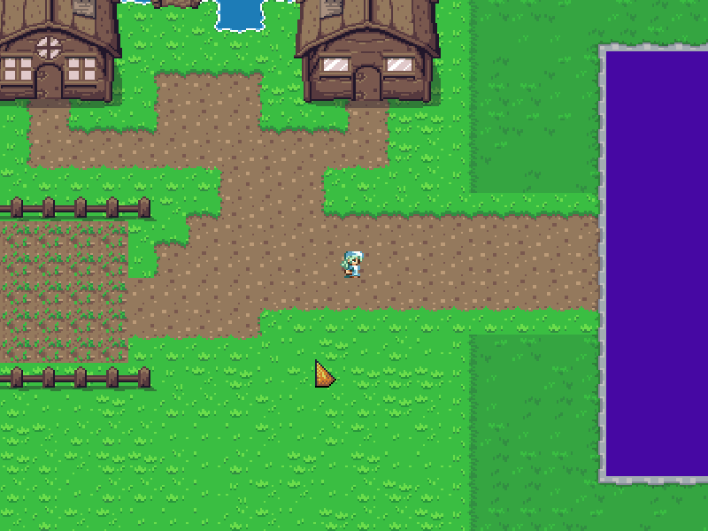

# Oasis

### What is Oasis?

Oasis is a multiplayer game with RPG like mechanics. These include quests, skills and the likes.

### How far along are you?

Oasis only has basic elements like multiplayer and one skill so far.

### What was Oasis built with?

[LunarGdx For Multiplayer](https://github.com/Vrekt/LunarGdx)

... and of-course LibGDX.

### Features

- Multiplayer
- Unique UI inspired by [DevDuck](https://www.youtube.com/devduck)
- Worlds
- Farming Skill
- etc.

# Assets credits

[Font](https://opengameart.org/content/pixel-fonts-by-pix3m)
[World](https://opengameart.org/content/zelda-like-tilesets-and-sprites)
[Temporary Humanoids](https://opengameart.org/content/dawnlike-16x16-universal-rogue-like-tileset-v181)

### Characters
[OpenGameArt](https://opengameart.org/content/antifareas-rpg-sprite-set-1-enlarged-w-transparent-background-fixed)

**Author: Antifarea**

- Temporary Humanoids by DawnBringer and DragonDePlatino
