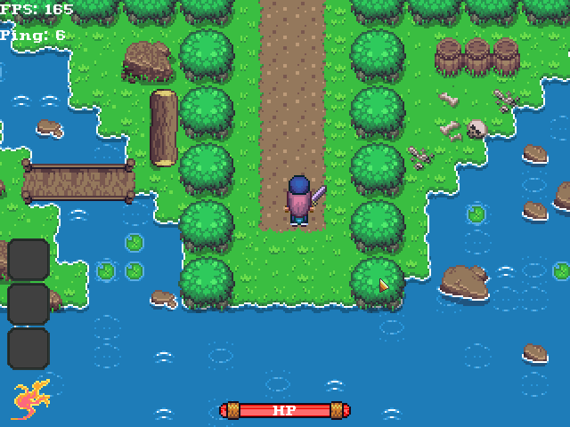
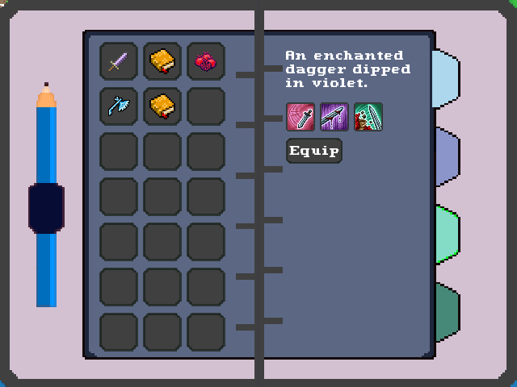
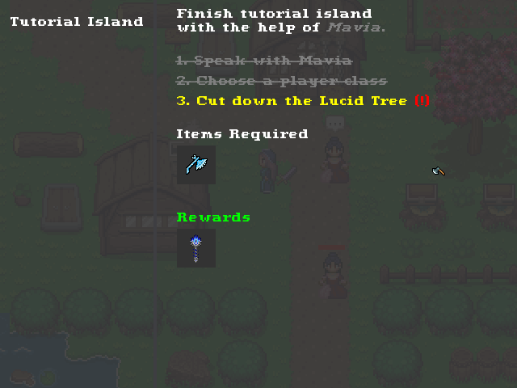
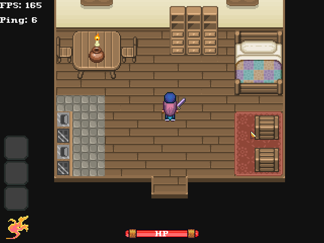
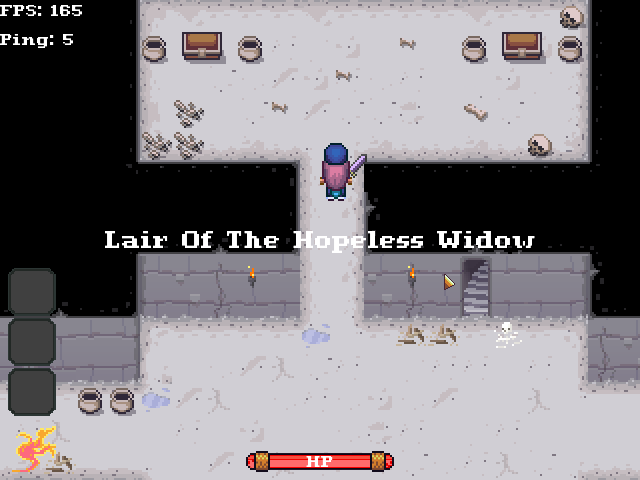

# Oasis
Oasis is a multiplayer game built with [Lunar](https://github.com/Vrekt/LunarGdx) and LibGDX.
  - Multiplayer game structure
  - Worlds, entities, collision, etc.
  - UI
  - Local networking for singeplayer
  - Robust entity system

  

  

  

  

  

