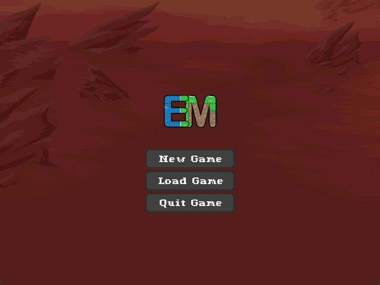
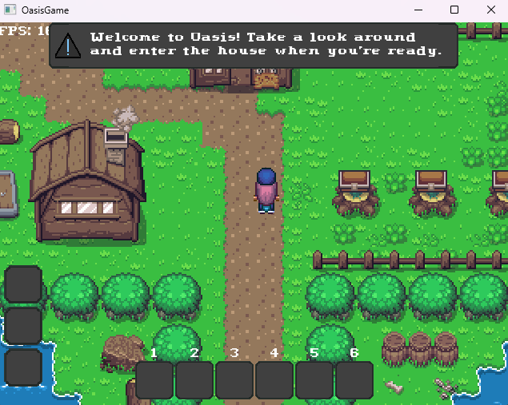
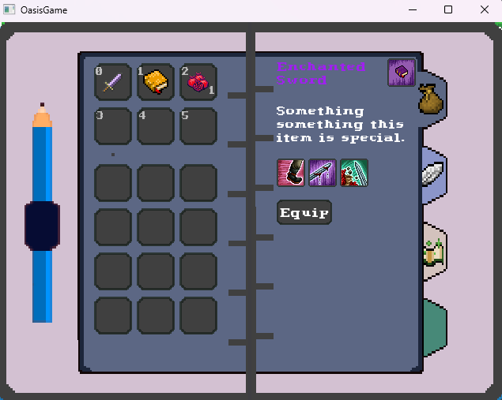
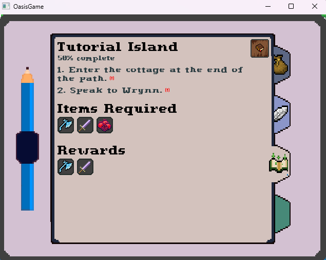
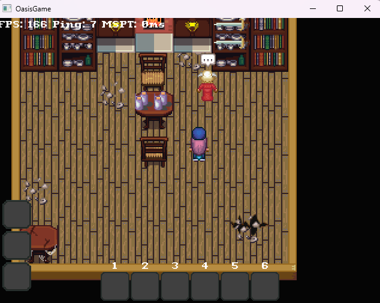

# Oasis
Oasis is a multiplayer game built with [Lunar](https://github.com/Vrekt/LunarGdx) and LibGDX.

# Features as of 6/13/24
- Multiple worlds
- Multiple enterable interiors
- Guis:
  - HUD
  - Chat
  - Inventory
  - Containers
  - Quest
  - WorldMap
  - Dialog
  - Lockpicking
  - Misc, like signs
- Saving and loading
- Entities with AI and states
- Basic combat with animations
- Activities like lockpicking
- Area effect clouds, like minecraft
- Many different types of interactions
- Items, weapons, artifacts
- Item attributes and player effects
- Basic sound
- Basic multiplayer

  

  

  

  

  

